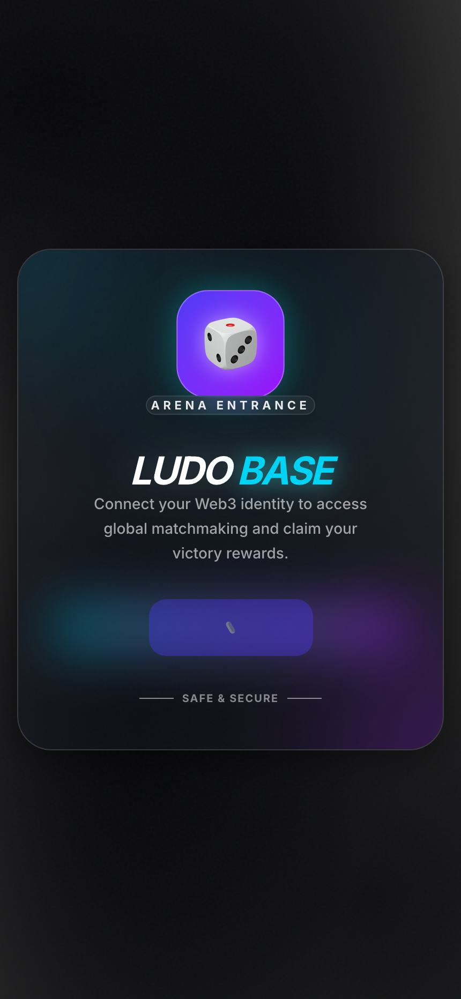
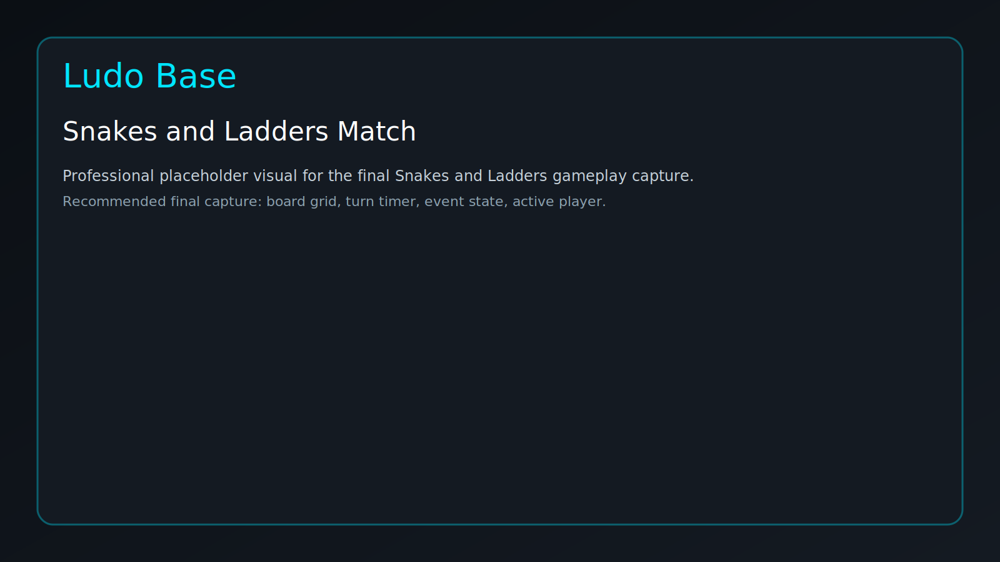
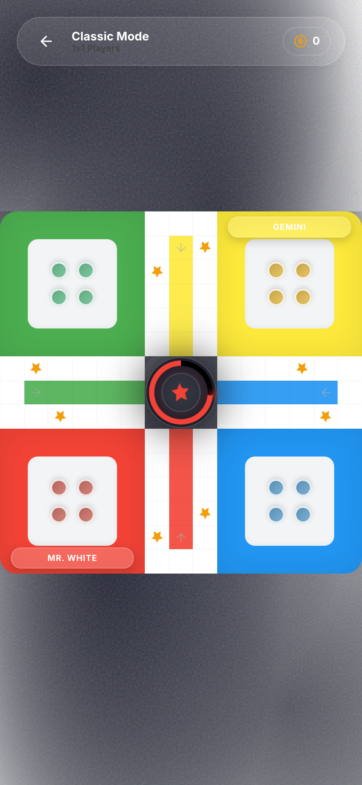
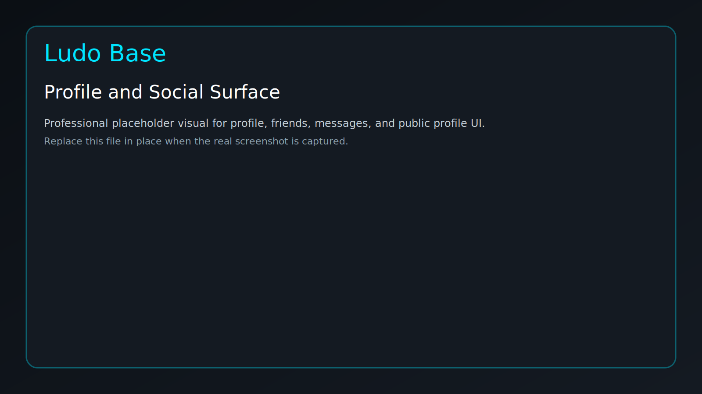
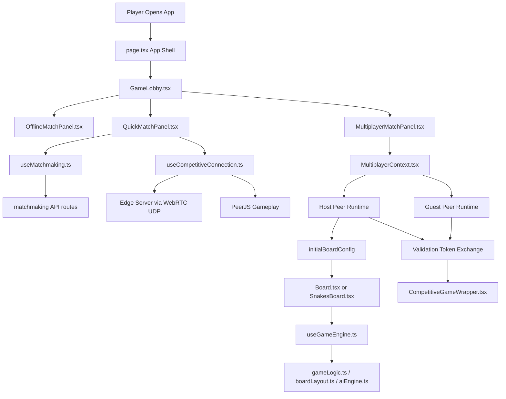
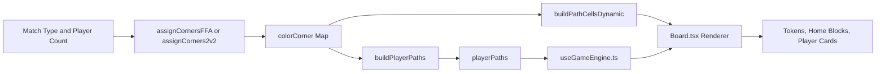
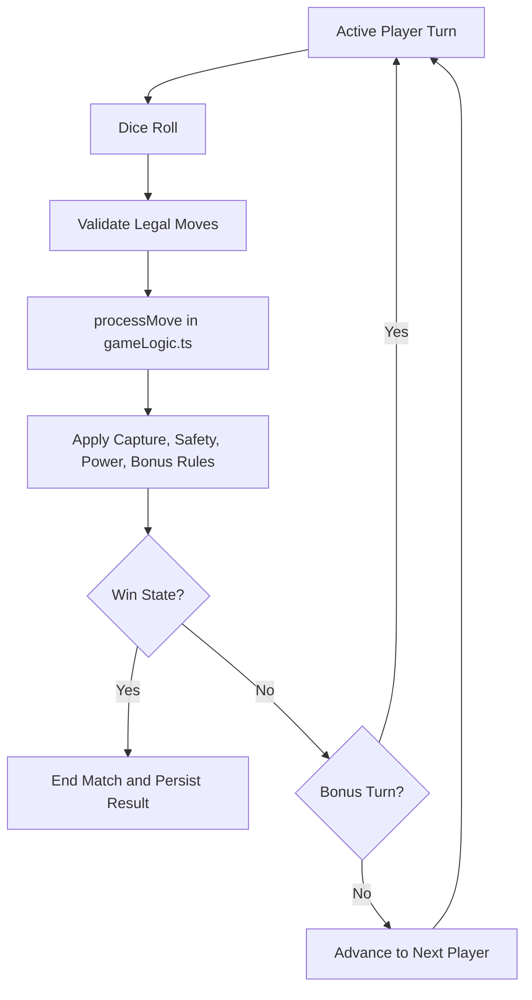

# Ludo Base Game Design Document

**Project:** Ludo Base
**Document Type:** Game Design Document (GDD)
**Document Status:** Working Draft
**Product State:** Playable prototype with competitive multiplayer, social, and backend integration work
**Last Updated:** March 16, 2026

## Document Control

### Revision History

| Version | Date | Author | Summary |
| --- | --- | --- | --- |
| 0.1 | March 14, 2026 | Codex + Project Team | Converted repo discussion notes into a structured GDD |
| 0.2 | March 14, 2026 | Codex + Project Team | Added revision history, architecture diagrams, visual reference slots, and renamed the document |
| 0.3 | March 16, 2026 | Codex + Project Team | Added WebRTC UDP + PeerJS hybrid architecture, competitive integrity features, and updated technical architecture |

### Intended Audience

- Product and design collaborators defining game direction
- Engineering contributors implementing gameplay, multiplayer, and backend systems
- QA and test contributors validating rules, sync behavior, and progression flows
- External reviewers who need a professional overview of the project state

## 1. Executive Summary

Ludo Base is a mobile-first competitive social board game platform built around modernized Ludo and Snakes & Ladders play. The product combines classic turn-based board mechanics with competitive multiplayer featuring sub-20ms matchmaking, private lobbies, wallet-linked identity, social discovery, persistent profiles, and a stylized game dashboard.

The current implementation supports a playable core loop, alternate board modes, AI opponents, competitive matchmaking with server-validated integrity, real-time lobby flow, profile sync, and a large portion of the supporting UI shell. The system uses a hybrid WebRTC UDP + PeerJS architecture that provides competitive integrity while maintaining reliable gameplay through a modular architecture with extracted game rules, board layout helpers, multiplayer context, and shared data layers.

This document is intended to serve two purposes:
- present the project in a professional GDD format;
- preserve implementation-aware notes so design, product, and engineering discussions stay aligned.

## 1.1 Visual Reference Slots

The sections below are intentionally included so the document can evolve from a strong written GDD into a presentation-ready project spec.

Current asset status:
- screenshot and GIF slots are now standardized under `docs/gdd/`;
- the folder structure and capture guide are in place;
- real captures from the live Vercel deployment are now in place for dashboard, multiplayer lobby, profile, and classic board states;
- `snakes-board` and the GIF motion slots still remain placeholder-only.

### Dashboard Overview

Preferred capture:
- top navigation;
- footer navigation;
- active slide panel state;
- overall art direction.

### Lobby and Match Setup

<p align="center">
  
  
</p>

Preferred capture:
- host lobby slots;
- invite state;
- quick-match state;
- offline versus multiplayer entry options.

### Classic Board Match

Preferred capture:
- token layout;
- player cards;
- dice interaction;
- dynamic corner assignment visible in-match.

### Snakes and Ladders Match

<p align="center">
  
</p>

Preferred capture:
- full board grid;
- event message state;
- turn timer and active player feedback.

### Profile and Social Surface

<p align="center">
  
  
</p>

Preferred capture:
- profile panel;
- friends list;
- public profile modal;
- unread or notification state.

## 2. Product Vision

### 2.1 Vision Statement

Create a polished, socially driven board game experience where familiar tabletop rules feel fast, competitive, and connected to modern identity, matchmaking, and progression systems.

### 2.2 Player Experience Goals

- Deliver a recognizable Ludo experience with modern feedback, pacing, and UX clarity.
- Support fast entry into matches through offline play, invites, and quick match.
- Make social identity visible through wallet-linked profiles, friends, messages, and public profile surfaces.
- Preserve the fun of board randomness while improving readability, animation, and session flow.
- Build a platform foundation that can later support progression, cosmetics, marketplace features, and onchain extensions.

### 2.3 Design Pillars

- **Readable Strategy:** Rules should remain clear even when board seats, corners, or teams are dynamically assigned.
- **Fast Session Start:** Users should be able to start offline, host privately, or search publicly with minimal friction.
- **Social Presence:** Identity, status, invites, and direct interaction should feel native to the product, not bolted on.
- **Deterministic Core Rules:** Move resolution, turn transitions, win states, and multiplayer sync must be logically defensible.
- **Mobile-First Presentation:** The game should feel like an app product, not a generic web page with a board embedded in it.

## 3. Current Scope

### 3.1 Implemented or Partially Implemented

- Classic Ludo board flow
- Power mode variant support
- Snakes & Ladders mode
- Offline play, bot-assisted play, and multiplayer routing
- Private room hosting and joining
- Competitive quick-match queue flow with server validation
- WebRTC UDP + PeerJS hybrid architecture for competitive integrity
- Sub-20ms matchmaking via edge servers with "Edge Verified UDP" status
- Validation token system for competitive match integrity
- Friend and public profile surfaces
- Profile sync through wallet, frame, and Farcaster fallback sources
- Messaging foundation and unread-count systems
- Theme switching and audio controls
- Match recording and leaderboard-ready stat paths
- Provably fair dice roll system with cryptographic commitment/reveal protocol

### 3.2 In Progress

- Full hardening of matchmaking backend and queue migrations
- Complete migration of old board-side logic into extracted engine modules
- Production-grade server-side persistence and transaction safety
- Realtime social systems replacing mock or polling-heavy flows
- Asset completion and polish pass for avatars, OG media, and branded visuals

## 4. Core Game Modes

### 4.1 Classic Ludo

Classic Ludo is the primary game mode. Players move tokens around a shared board based on dice rolls, attempt captures, use safe cells defensively, and race to bring all tokens home.

Key supported behaviors in the current system:
- token release from home;
- standard turn rotation;
- captures and bonus turn logic;
- safe-cell logic;
- overshoot and movement validation;
- team-aware win logic for 2v2;
- AI participation for local or fallback sessions.

### 4.2 Power Ludo

Power mode extends the classic board with tactical modifiers and stateful player powers. The UI already exposes power-state visibility, while the engine and shared game state carry the tactical runtime.

Current status:
- presentation and state plumbing exist;
- some effect behavior is implemented;
- balancing and full rules coverage still need consolidation.

### 4.3 Snakes & Ladders

Snakes & Ladders is implemented as a separate board flow with a linear 1 to 100 progression model. It preserves the same product-level UX language as the main game, including turn sequencing, timer pressure, AI behavior, and win celebration.

Key rules already supported:
- serpentine 10x10 board mapping;
- step-by-step movement animation;
- overshoot bounce-back;
- deterministic snake and ladder remapping;
- win detection at tile 100.

## 5. Gameplay Systems

### 5.1 Turn Structure

Across the game modes, the turn loop follows a recognizable state machine:
- determine active player;
- roll dice;
- validate available actions;
- apply movement and resulting rule effects;
- resolve captures, bonus turns, and win state;
- advance to next player or remain on current player if rules allow.

The current architecture is moving this logic into reusable engine and pure-rule modules so turn behavior becomes easier to test and safer to synchronize online.

### 5.2 AI and Timeout Behavior

The system already supports AI participation and timeout-based automation. This matters for both offline pacing and resilience when users become inactive.

Current behaviors:
- bots evaluate candidate moves using heuristic scoring;
- timed turns can escalate into strike logic;
- repeated inactivity can lead to automatic actions;
- AI behavior is delayed slightly to avoid robotic, instant feedback.

### 5.3 Win Conditions

Win handling exists for both free-for-all and team-based matches. The rules engine resolves whether a player or team has completed the required token progression and blocks further state changes once the match reaches terminal state.

### 5.4 Feedback Systems

The product already includes several forms of gameplay feedback:
- dice animation and interaction feedback;
- movement and capture sound effects;
- ambient theme-based sound;
- event messages;
- confetti and strong win-state visual signaling.

## 6. Board Design and Layout Logic

### 6.1 Classic Board Presentation

The main Ludo board is no longer hardcoded to one seat pattern. Instead, board geometry is derived from shared layout helpers and a board configuration object. This allows the UI to support shuffled starting positions while still preserving legal movement routes.

### 6.2 Dynamic Corner Assignment

A major architectural improvement in the current codebase is the move away from fixed-color seating.

The board system now supports:
- free-for-all corner shuffling for 1v1 and 4-player sessions;
- team-safe diagonal assignment for 2v2 sessions;
- dynamic path generation from seat assignment;
- matching of rendered home blocks, movement cells, and player cards to the same corner model.

This is important because the visual board, the movement engine, and multiplayer payloads must all agree on the same board geometry. The current layout module is now the source of truth for that agreement.

### 6.3 Snakes Board Layout

Snakes & Ladders uses a different spatial model. Rather than a path around a perimeter board, tile numbers are mapped into a serpentine grid so that odd and even rows reverse direction correctly.

The implementation separates visual stepping from final resolved position, which allows movement animation to remain readable before snake and ladder jumps are applied.

## 7. Multiplayer and Social Design

### 7.1 Multiplayer Model

The multiplayer system uses a hybrid architecture with competitive integrity features:

- **WebRTC UDP for matchmaking**: Sub-20ms competitive matchmaking via edge servers with server-validated game configurations
- **PeerJS for gameplay**: Reliable, ordered game state sync with proven P2P connectivity
- **Validation tokens**: Cryptographically secure tokens exchanged between edge server and clients
- **Host-authoritative model**: The host owns the room, participant mapping, lobby state, and game-start payload
- **Automatic fallback**: Seamless transition to traditional P2P when WebRTC unavailable

This architecture provides competitive integrity while maintaining reliable gameplay and universal browser compatibility.

### 7.2 Lobby Flow

The pre-game experience now supports three entry paths:
- offline match setup;
- private multiplayer lobby;
- competitive quick-match queue search.

The lobby system already supports:
- host-created rooms;
- joining by room code;
- player slot rendering;
- invites;
- slot swapping and kicking;
- competitive quick-match escalation for partially filled lobbies;
- game start only when state rules allow it;
- "Edge Verified UDP" connection status indicator;
- validation token verification for competitive matches.

### 7.3 Matchmaking

Quick match is implemented through a queue flow backed by Supabase RPC and client polling. The product already has a staged user experience for:
- entering a queue bucket;
- showing active search state;
- polling for status changes;
- cancelling searches;
- timing out into retry or AI fallback.

The main design risk is backend dependency. If the queue migration or RPC is missing, the quick-match path fails completely.

### 7.4 Presence, Friends, and Messaging

Social systems are a major part of the product identity. The repo already includes:
- friend list and request models;
- online and in-match presence tracking;
- public profile actions such as friend, block, unblock, report, and DM;
- message conversations, unread counts, and realtime message updates;
- invite notifications that can interrupt the app shell.

These systems are not fully finished, but the product direction is clear: Ludo Base is being built as a social board-game platform, not only a match screen.

## 8. Player Identity and Progression

### 8.1 Identity Model

Player identity is wallet-aware and uses fallback resolution from several sources. The current priority model is:
- frame SDK user context;
- Farcaster wallet lookup;
- onchain name/avatar lookup;
- local fallback display naming.

When a profile is incomplete, the system falls back to a professional anonymous identity format:
- `Guest <LAST_6_CHARS>`

This identity fallback is important because it keeps the UI coherent across headers, player cards, leaderboard rows, and social surfaces.

### 8.2 Profile and Stats

The current profile system already presents:
- avatar selection and profile editing surfaces;
- match-oriented stats such as wins, matches, and streaks;
- public and private profile views;
- live refresh through player-row subscriptions.

### 8.3 Missions, Leaderboards, and Marketplace

The product already contains the UI and data contracts for three important meta layers:
- **Leaderboard:** tier-based, daily, and monthly ranking views.
- **Missions:** daily and weekly mission structures with progress and reward states.
- **Marketplace:** typed inventory and collectible presentation for future cosmetic or asset systems.

These systems are still partially mocked in places, but they already define the shape of the long-term progression layer.

## 9. UX, Visual Direction, and Audio

### 9.1 UX Direction

The product uses a mobile-first, panel-driven dashboard that routes into active game boards. The app shell already supports:
- top and bottom navigation surfaces;
- slide panels and modals for social and settings features;
- invite overlays and interruption states;
- game-first transitions from dashboard to active match.

### 9.2 Themes

Theme switching is already integrated and persistent. The product currently supports:
- Pastel
- Midnight
- Cyberpunk
- Classic

Theme selection is stored locally and affects the visual environment without disrupting gameplay state.

### 9.3 Audio

The game includes a procedural audio system rather than relying entirely on static media assets. Core gameplay actions can trigger sound effects, while ambient audio changes by theme.

This is a strong product choice because it keeps iteration lightweight and allows the project to preserve a distinct feel even before a final audio asset pack is introduced.

## 10. Technical Architecture Summary

### 10.1 Architectural Direction

The codebase is actively shifting from component-level all-in-one logic to modular systems with clearer boundaries.

Current architectural split:
- UI rendering in board and panel components;
- game orchestration in `useGameEngine.ts`;
- pure rules in `gameLogic.ts` and `snakesLogic.ts`;
- board geometry in `boardLayout.ts`;
- AI decision-making in `aiEngine.ts`;
- multiplayer runtime in `MultiplayerContext.tsx`;
- app-wide data hydration in `GameDataContext.tsx`.

This direction is correct. It improves maintainability, testability, and multiplayer safety.

### 10.1.1 Multiplayer Runtime Diagram



### 10.1.2 Board Layout Generation Diagram



### 10.1.3 Core Turn Resolution Diagram



### 10.2 Backend and Persistence

The backend stack relies heavily on Supabase for:
- profile storage;
- presence state;
- friendships;
- conversations and messages;
- leaderboard-compatible stats;
- match recording;
- matchmaking queue state.

The codebase also includes targeted API routes for profile enrichment, friends lookup, match recording, and matchmaking operations.

### 10.3 Current Technical Risks

- critical backend features depend on migration parity across environments;
- some persistence flows are still multi-step and non-transactional;
- multiplayer logic remains complex and should be split into smaller modules over time;
- parts of the social and progression layers are still mock-driven or only partially authoritative;
- board and engine migration is improved but not yet complete.

## 11. Production Readiness Assessment

### 11.1 Strong Areas

- modular direction of gameplay architecture;
- functional multiplayer lobby concept;
- competitive quick-match with server validation;
- WebRTC UDP + PeerJS hybrid architecture for competitive integrity;
- sub-20ms matchmaking via edge servers;
- provably fair dice roll system with cryptographic validation;
- dynamic board layout system with shuffled starts;
- wallet and social identity integration;
- high-value UI shell and feature surfaces already in place.

### 11.2 Areas Requiring Hardening

- transactional match persistence;
- migration verification and deployment discipline;
- exhaustive gameplay rule tests;
- multiplayer sequencing and acknowledgement safety;
- message moderation and safety enforcement;
- completion of static assets and polish details;
- edge server infrastructure for production WebRTC deployment.

## 12. Priority Roadmap

### 12.1 Immediate Priorities

1. Finish sync-safe turn handling between `Board.tsx`, `useGameEngine.ts`, and `MultiplayerContext.tsx`.
2. Move sensitive match-result writes fully into hardened server-side transactional flow.
3. Verify and stabilize matchmaking migrations and queue behavior across environments.
4. Replace remaining mock-driven social and profile surfaces with authoritative data paths.
5. Add deterministic tests for movement rules, board layout generation, AI, and multiplayer transitions.

### 12.2 Secondary Priorities

1. Finalize asset pack for avatars, OG media, and background parity.
2. Improve settings, support, and account diagnostics surfaces.
3. Add stronger quick-match debugging and network failure visibility.
4. Expand progression systems with canonical mission and leaderboard backends.
5. Refine power-mode rule coverage and balancing.

## 13. Presentation and Reference Materials

### 13.1 Recommended Supporting Assets

To make this GDD presentation-ready for collaborators, the repo should eventually include:
- annotated screenshots for dashboard, lobby, classic board, and snakes board;
- one GIF for quick-match flow;
- one GIF for shuffled-corner board initialization;
- one GIF for invite accept to match-start flow;
- export-ready logo, social preview, and board key-art assets.

### 13.2 Recommended Asset Folder Layout

```text
docs/
  gdd/
    dashboard-overview.svg
    lobby-flow.svg
    classic-board.svg
    snakes-board.svg
    social-surface.svg
    quickmatch-flow.gif
    shuffled-board-layout.gif
    invite-to-match.gif
```

### 13.3 Style Notes for Future Screenshots

- Capture at mobile-first aspect ratios first, then desktop if needed.
- Avoid placeholder data where possible; show realistic wallet/profile states.
- Use the same theme across all screenshots for consistency.
- Capture one active multiplayer lobby with filled slots so the product reads as social and live.

## 14. Technical Appendix: File-by-File Implementation Notes

This appendix preserves implementation-aware notes in a cleaner format. File names are intentionally shown without long paths so the document stays readable.

### 14.1 App Shell

#### `layout.tsx`
**Status:** Implemented  
Defines the global metadata, mobile viewport behavior, and root app wrapper. It is the entry point that makes the app feel like a product shell rather than a normal web page.

#### `Providers.tsx`
**Status:** Implemented  
Composes wagmi, React Query, OnchainKit, frame readiness, multiplayer, and background profile sync. This file is effectively the root dependency graph for wallet-aware gameplay.

#### `page.tsx`
**Status:** Partial / Active  
Acts as the top-level app shell that decides whether the user is in dashboard flow, lobby flow, invite flow, or active match flow. It also prepares shuffled multiplayer board configuration before a game starts.

### 14.2 Core Board Components

#### `Board.tsx`
**Status:** Partial / Active  
Primary Classic and Power board renderer. It is increasingly presentation-focused, while rules and orchestration move into shared engine modules.

What it does:
- renders the main board, tokens, home areas, and player identity cards;
- consumes dynamic board configuration instead of assuming fixed seats;
- renders synchronized multiplayer participant identity;
- delegates most turn logic to `useGameEngine.ts`.

How it works in the current system:
- builds or consumes `boardConfig` with player mapping, corner assignment, and player paths;
- uses layout helpers so shuffled corner starts remain valid;
- reflects timer, AFK, strike, power, and token states produced by the engine.

Why it matters:
- this is the visible heart of the product;
- if this file and the engine disagree about layout or rule state, players immediately feel it.

#### `SnakesBoard.tsx`
**Status:** Partial / Active  
Alternate board implementation for Snakes & Ladders.

What it does:
- animates step-by-step movement along a 1 to 100 track;
- resolves bounce-back and snake or ladder jumps;
- manages mode-specific turn state, timer behavior, and win handling.

How it works in the current system:
- separates visual movement from final resolved logic position;
- uses serpentine board mapping so tile positions remain visually correct;
- mirrors the main game’s UX expectations for turn timing and celebration.

#### `Dice.tsx`
**Status:** Implemented  
Shared dice interaction and animation component. It keeps the roll experience consistent across board variants.

#### `ThemeSwitcher.tsx`
**Status:** Implemented  
Theme preference selector with local persistence. Changes the presentation layer without disrupting match state.

#### `AudioToggle.tsx`
**Status:** Implemented  
Audio preference control for sound effects and music flags consumed by the audio hook.

### 14.3 Identity and Entry Components

#### `ProfileSyncer.tsx`
**Status:** Partial / Active  
Background identity resolver and persistence bridge. It gathers identity from frame, Farcaster, and onchain sources, then normalizes that data into the player table.

#### `WalletConnectCard.tsx`
**Status:** Partial / Active  
Wallet onboarding surface. It handles session entry cleanly, but it is not yet tied to a full transaction or wager lifecycle.

### 14.4 Lobby, Match Entry, and Dashboard Components

#### `GameLobby.tsx`
**Status:** Partial / Active  
High-level coordinator for offline matches, private lobbies, and quick match. It translates player intent into the correct pre-game flow.

#### `QuickMatchPanel.tsx`
**Status:** Partial / Active  
Frontend queue search surface with searching, matched, timeout, retry, and AI fallback states.

#### `MultiplayerMatchPanel.tsx`
**Status:** Partial / Active
Host-driven lobby control center with slot cards, invites, swap and kick controls, start-state validation, and competitive match verification.

#### `app/components/Multiplayer/CompetitiveGameWrapper.tsx`
**Status:** Implemented
UI wrapper that provides competitive connection status and "Verified Competitive Session" badge.

What it does:
- wraps multiplayer game content with competitive verification;
- displays real-time connection status with "Edge Verified UDP" indicator;
- provides fallback connection status when WebRTC unavailable;
- manages competitive match loading and error states;
- ensures all competitive matches are properly validated.

#### `OfflineMatchPanel.tsx`
**Status:** Partial / Active  
Lightweight launch surface for offline and bot-backed sessions.

#### `InviteNotification.tsx`
**Status:** Partial / Active  
Global invite banner that presents accept or decline actions with auto-expiration behavior.

#### `HeaderNavPanel.tsx`
**Status:** Partial / Active  
Top-level dashboard surface showing identity, currency placeholder values, unread count, and settings access.

#### `FooterNavPanel.tsx`
**Status:** Partial / Active  
Dashboard navigation router for profile, friends, leaderboard, missions, marketplace, and messages.

#### `SettingsPanel.tsx`
**Status:** Partial / Active  
Expanded preference and account surface for theme, audio, and disconnect behavior.

### 14.5 Social and Profile Components

#### `FriendsPanel.tsx`
**Status:** Partial / Active  
Social graph presentation surface with friend lists, request lists, status indicators, and future action hooks.

#### `Leaderboard.tsx`
**Status:** Partial / Active  
Competitive ranking surface that already defines ranking semantics for tier, daily, and monthly views.

#### `MissionPanel.tsx`
**Status:** Partial / Active  
Progression panel for recurring goals and rewards. Good schema foundation, but not fully authoritative yet.

#### `MarketplacePanel.tsx`
**Status:** Partial / Active  
Typed inventory and collectible surface that establishes the contract for cosmetic or asset-driven expansion.

#### `UserProfilePanel.tsx`
**Status:** Partial / Active  
Profile editing and stat-visualization surface with strong visual presentation but incomplete persistence wiring.

#### `MessagesPanel.tsx`
**Status:** Partial / Active  
Conversation UI surface. The data model is stronger than the visible UI today, which means this area still has product expansion room.

#### `PlayerProfileSheet.tsx`
**Status:** Partial / Active  
Contextual player action sheet used for friend, DM, block, and moderation-adjacent actions during gameplay and profile inspection.

#### `PublicProfileModal.tsx`
**Status:** Partial / Active  
Public-facing profile and relationship action center with friend, block, report, and DM flows.

#### `PresenceManager.tsx`
**Status:** Partial / Active  
Heartbeat-based presence synchronizer that updates online and in-match status.

### 14.6 Runtime Support and Test Harness

#### `FrameProvider.tsx`
**Status:** Implemented  
Farcaster frame bootstrapper that ensures frame APIs are ready before dependent flows execute.

#### `GameLobbyTest.tsx` and `app/uitest/page.tsx`
**Status:** Partial / Active  
Integration playground for validating complex dashboard and lobby flows outside the main route.

### 14.7 Hooks and Engine Layer

#### `useAudio.ts`
**Status:** Implemented  
Procedural audio engine for move, capture, turn, strike, win, and theme-based ambient playback.

#### `useMultiplayer.ts` (app-level)
**Status:** Partial / Legacy Utility  
PeerJS-oriented helper used for direct sync experiments. It overlaps somewhat with the newer context-driven runtime.

#### `useMessages.ts`
**Status:** Partial / Active  
Conversation, unread-count, profile-hydration, and realtime messaging state engine.

#### `MultiplayerContext.tsx`
**Status:** Partial / Critical
Primary multiplayer runtime service.

What it does:
- hosts rooms and lobby state;
- manages multi-peer participant connections;
- sends game and lobby actions;
- supports invites, quick-match starts, slot swaps, and kicks;
- maps wallet-linked participant identity into live rooms;
- integrates validation token verification for competitive matches;
- implements provably fair dice roll system with cryptographic commitment/reveal protocol.

Why it matters:
- this file is the multiplayer backbone;
- the current architecture correctly treats host state as authoritative.

#### `useCompetitiveConnection.ts`
**Status:** Implemented
Hybrid WebRTC UDP + PeerJS connection manager for competitive matchmaking.

What it does:
- connects to edge servers via WebRTC UDP for sub-20ms matchmaking;
- establishes PeerJS connections for reliable gameplay;
- manages validation token exchange between edge server and clients;
- provides automatic fallback to traditional P2P when WebRTC unavailable;
- orchestrates the seamless transition from WebRTC matchmaking to PeerJS gameplay.

Why it matters:
- enables competitive integrity with server-validated matchmaking;
- maintains universal browser compatibility through fallback mechanisms;
- provides "Edge Verified UDP" status for competitive assurance.

#### `useCurrentUser.ts`
**Status:** Partial / Active
Current-user profile hook with realtime refresh and fallback guest naming.

#### `useGameEngine.ts`
**Status:** Partial / Critical  
Main gameplay orchestration layer for Classic and Power mode.

What it does:
- owns match-state progression;
- applies deterministic move logic via shared rules;
- coordinates AI, multiplayer sync, AFK handling, and persistence side effects;
- reduces the burden on `Board.tsx`.

#### `GameDataContext.tsx`
**Status:** Partial / Active  
Shared data bootstrapper and cache for profile, leaderboard, friends, messages, and other dashboard-level data.

#### `useMatchmaking.ts`
**Status:** Partial / Active  
Client-side state machine for matchmaking queue lifecycle and cleanup.

### 14.8 API Layer

#### `farcaster/route.ts`
**Status:** Partial / Active  
Wallet-to-Farcaster identity lookup endpoint used when native frame context is not available.

#### `friends/route.ts`
**Status:** Partial / Active  
Bridge between Farcaster social graph data and local player records.

#### `match/record/route.ts`
**Status:** Partial / Critical  
Server-side endpoint for persisting match outcomes and aggregate player stats.

#### `matchmaking/join/route.ts`
**Status:** Partial / Critical  
Queue entry endpoint backed by `join_matchmaking` RPC. This route is essential for quick match.

#### `matchmaking/status/route.ts`
**Status:** Partial / Active  
Polling endpoint for current queue state and match resolution.

#### `matchmaking/cancel/route.ts`
**Status:** Partial / Active  
Queue cleanup endpoint that prevents stale or abandoned search tickets from piling up.

### 14.9 Shared Libraries

#### `types.ts`
**Status:** Partial / Critical  
Shared type contract for gameplay, lobby, invite, participant, and synchronization models.

#### `supabase.ts`
**Status:** Implemented  
Central Supabase client bootstrap used across app and route logic.

#### `matchRecorder.ts`
**Status:** Partial / Active  
Client-accessible match persistence helper. Useful now, but should eventually defer fully to hardened server-side flow.

#### `boardLayout.ts`
**Status:** Partial / Critical  
Board geometry and seat-assignment source of truth.

What it does:
- assigns corners for free-for-all and 2v2 play;
- shuffles players into legal board arrangements;
- builds movement paths from those assignments;
- keeps UI geometry aligned with actual rule paths.

Why it matters:
- this module is what makes shuffled starts and dynamic board layouts safe.

#### `gameLogic.ts`
**Status:** Partial / Critical
Deterministic rules engine for Classic and Power mode plus some multiplayer lobby helpers.

#### `encryption.ts`
**Status:** Partial / Foundation
Crypto helper set for private or peer-oriented messaging features.

#### `aiEngine.ts`
**Status:** Partial / Active
Heuristic bot move selector based on move value, safety, progress, and capture opportunity.

#### `snakesLogic.ts`
**Status:** Partial / Active
Pure rules module for Snakes & Ladders movement resolution.

#### `lib/multiplayer/edge-server-client.ts`
**Status:** Implemented
WebRTC UDP client for connecting to edge servers for competitive matchmaking.

What it does:
- establishes WebRTC data channel connections to edge servers;
- handles signaling via HTTPS for NAT traversal;
- manages sub-20ms matchmaking requests and responses;
- validates competitive game configurations via server;
- provides automatic fallback when WebRTC unavailable.

#### `lib/multiplayer/peerjs-gameplay.ts`
**Status:** Implemented
Enhanced PeerJS client for reliable gameplay state synchronization.

What it does:
- manages PeerJS P2P connections for gameplay;
- validates game state integrity before processing;
- handles validation token verification for competitive matches;
- provides secure state sync with cryptographic validation;
- implements provably fair dice roll protocol with commitment/reveal.

#### `lib/multiplayer/fallback-connection.ts`
**Status:** Implemented
Fallback connection manager for network compatibility.

What it does:
- manages fallback from WebRTC to traditional P2P when needed;
- handles network failure scenarios gracefully;
- maintains competitive integrity during connection migrations;
- provides seamless experience across different network conditions.

#### `lib/types/multiplayer.types.ts`
**Status:** Implemented
Type definitions for multiplayer architecture including validation tokens and competitive features.

### 14.10 Database and Migration Layer

#### `add_status_columns.sql`
**Status:** Partial / Active  
Presence-schema migration that adds `status` and `last_seen_at` support to the player model.

#### `status_cleanup_job.sql`
**Status:** Partial / Active  
Database cleanup routine that marks stale users offline when heartbeat writes stop.

#### `20240304_matchmaking_queue.sql`
**Status:** Partial / Critical  
Matchmaking queue schema and atomic join RPC. Required for quick-match functionality.

### 14.11 Styling and Static Assets

#### `globals.css` and `page.module.css`
**Status:** Partial / Active  
Visual contract for panel styling, board presentation, typography, motion, and theme-aware layout behavior.

#### `public` assets
**Status:** Pending Polish  
Some avatar and presentation assets still need completion or parity fixes. These do not block core gameplay, but they directly affect perceived production quality.

## 15. Document Maintenance Guidance

If this file is going to remain the main professional project document, the next formatting upgrades should be:
- add a short revision history table at the top;
- add screenshots or GIF references for dashboard, board, and lobby flows;
- add one diagram for multiplayer data flow and one for board layout generation;
- split Appendix sections further only when a file becomes important enough to deserve its own mini-spec.
