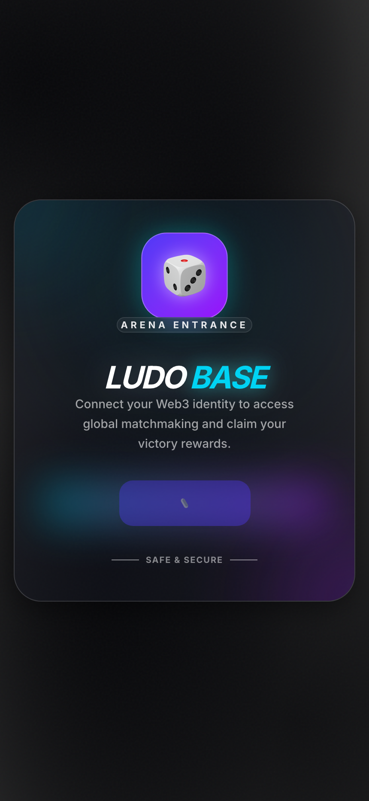
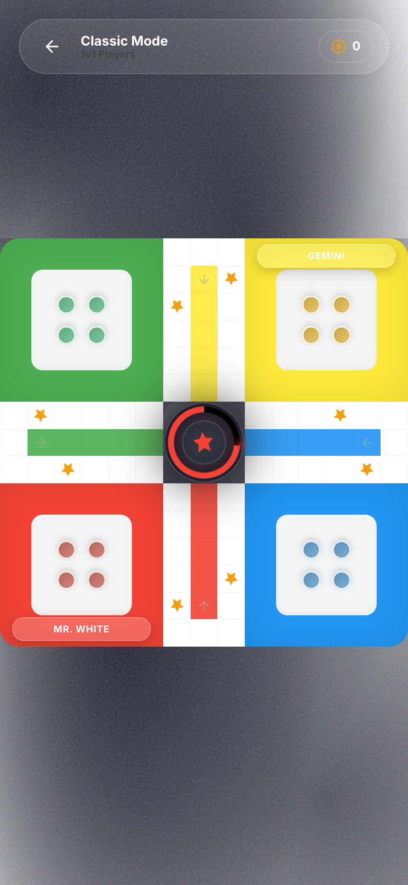
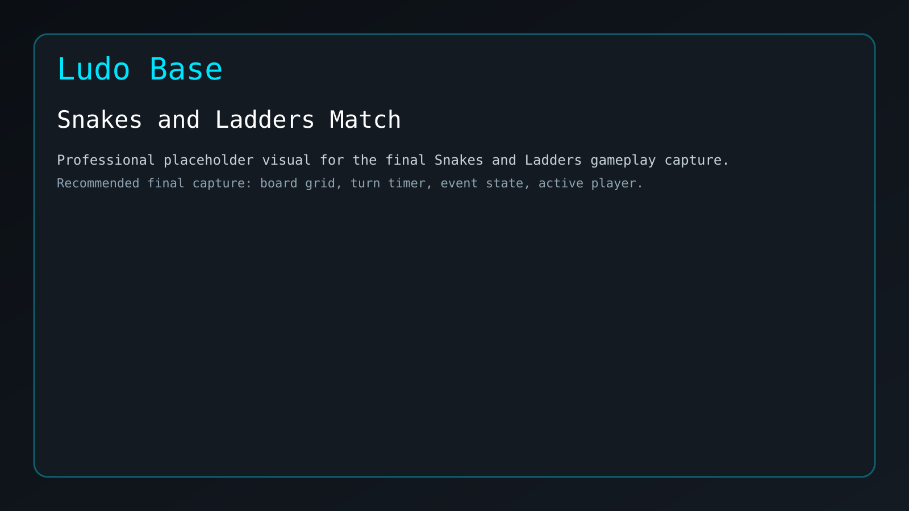
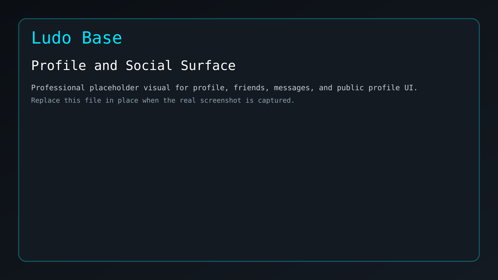

# 🎲 Ludo Base

[]()
[](https://nextjs.org/)
[](https://base.org/)

**Ludo Base** is a high-performance, Farcaster-native competitive board game platform built on the Base ecosystem. Experience the classic Ludo and Snakes & Ladders you love, upgraded with glassmorphism UI, real-time multiplayer, on-chain identity, and a secure spectator betting system.

---

## 📸 Visual Tour

<p align="center">
  
  
</p>

<p align="center">
  
  
  
</p>

---

## ✨ Key Features

- **🎮 Multiple Game Modes:**
  - **Ludo Classic:** Standard rules with competitive 1v1, 2v2, and 4P modes.
  - **Ludo Power:** Strategic twist with Shield, Bomb, Warp, and Boost tiles.
  - **Snakes & Ladders:** A fast-paced race to the top on a 10x10 grid.
- **🤝 Social-First Experience:**
  - **Farcaster Integrated:** Sign in with your Farcaster identity.
  - **Social Hub:** Friends lists, real-time messaging, and global leaderboards.
  - **Lobby System:** Host private rooms, invite friends, or jump into Quick Match.
- **🛡️ Competitive Integrity:**
  - **Edge Matchmaking:** Sub-20ms pairing via specialized edge servers.
  - **Provably Fair Dice:** Cryptographically secure dice rolls via Supabase Edge Functions.
  - **AFK Protection:** Intelligent strike system and AI-takeover for disconnected players.
- **💎 GambleFi & Spectator System:**
  - **Live Streaming:** Watch matches in real-time with zero-video state-sync technology.
  - **Spectator Betting:** Securely bet on matches with automated resolution and protocol revenue sharing.
- **🎨 Premium UI/UX:** Silvery swirly gradient dashboard with a textured glassmorphism aesthetic and responsive mobile-first design.

---

## 🛠️ Tech Stack

- **Frontend:** Next.js 16 (App Router), React 19, TypeScript, Tailwind CSS 4, Framer Motion.
- **Web3:** Wagmi, Coinbase OnchainKit, Farcaster Frame SDK.
- **Backend/Realtime:** Supabase (Auth, DB, Realtime, Edge Functions), PeerJS.
- **Networking:** Hybrid WebRTC UDP + P2P Mesh architecture.

---

## 🏗️ Architecture

Ludo Base uses a **Hybrid Mesh Communication Model** for maximum performance and reliability:

1.  **Reliability Layer (Supabase):** High-frequency actions (dice rolls, moves) are broadcast via Supabase global mesh.
2.  **P2P Layer (PeerJS):** Identity validation and specialized profile synchronization.
3.  **Edge Matchmaking:** Uses WebRTC UDP for near-instant pairing and "Edge Verified" match integrity.

For a deep dive into the engine, see [ENGINE_LOGIC.md](./ENGINE_LOGIC.md).

---

## 🚀 Getting Started

### Prerequisites

- Node.js 20+
- npm

### Installation

```bash
git clone <repository-url>
cd ludo-base
npm install
```

### Environment Setup

Create a `.env.local` file in the root directory:

```env
NEXT_PUBLIC_SUPABASE_URL=your_supabase_url
NEXT_PUBLIC_SUPABASE_ANON_KEY=your_supabase_key
# Add other required environment variables for Wallet/Farcaster
```

### Development

```bash
npm run dev
```
Open [http://localhost:3000](http://localhost:3000) to see the app.

### Production

```bash
npm run build
npm start
```

### Linting

```bash
npm run lint
```

---

## 📖 Documentation

- [Game Design Document (GDD)](./docs/gdd/GAME_DESIGN_DOCUMENT.md) - Full game mechanics and roadmap.
- [Engine Logic](./ENGINE_LOGIC.md) - Detailed technical source of truth.
- [Changelog](./CHANGELOG.md) - Recent updates and improvements.

---

## 📄 License

This project is licensed under the [LICENSE](./LICENSE) file.

---

*Created with ❤️ for the Base Ecosystem.*
