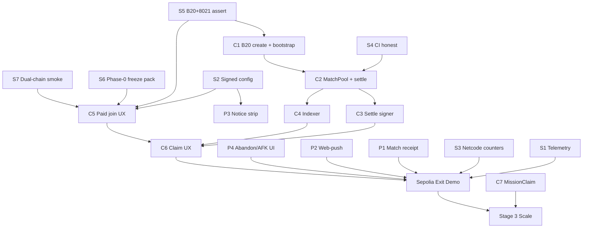

# Recommended Implementation Plan — Ludo Base

| Field | Value |
| --- | --- |
| **Project** | Ludo Base |
| **Document type** | Execution plan + sequencing recommendation (maps research → existing code) |
| **Inputs** | `docs/research/COMPETITIVE_LUDO_WORLD_LUDO_KING.md` §§6–13 · `docs/tokenomics/CHIPS_PLANNING.md` v4.3 · `AGENTS.md` invariants · `ENGINE_LOGIC.md` · current `hooks/` + `lib/` + `supabase/` |
| **Question answered** | Build **CHIPS/blockchain first**, **competitive gaps first**, or **mix**? |
| **Status** | Recommended plan (not a tokenomics rewrite) |
| **Last updated** | 2026-09-22 |

---

## Table of contents

- [0. Verdict](#0-verdict)
- [1. Why not pure-CHIPS or pure-gaps](#1-why-not-pure-chips-or-pure-gaps)
- [2. Existing system map (what we build on)](#2-existing-system-map-what-we-build-on)
- [3. Three tracks and their contract](#3-three-tracks-and-their-contract)
- [4. Sequencing — Spine → Dual-track → Scale](#4-sequencing--spine--dual-track--scale)
- [5. Detailed plan by track (mapped to files)](#5-detailed-plan-by-track-mapped-to-files)
- [6. Week-by-week (first 10 weeks)](#6-week-by-week-first-10-weeks)
- [7. Dependency graph](#7-dependency-graph)
- [8. What we refuse (keep the thesis intact)](#8-what-we-refuse-keep-the-thesis-intact)
- [9. Exit criteria per gate](#9-exit-criteria-per-gate)
- [10. Immediate next actions](#10-immediate-next-actions)

---

## 0. Verdict

**Implement a mix — not CHIPS alone, and not competitive gaps alone.**

Concretely: **2–3 weeks of a shared “Spine”**, then **CHIPS Phase 1 as the primary track** with **a thin product-ops track running in parallel**. King/World parity features (voice, i18n, ads, native shell) stay **after** the Sepolia settle loop is proven.

| Question | Answer |
| --- | --- |
| First? | **Spine** (telemetry, signed config, reconnect counters, lint/CI, **B20+ERC-8021 Foundry assertion**) |
| Main track after Spine? | **CHIPS Phase 1** (contracts → join/settle/claim on Sepolia) |
| Parallel track after Spine? | **Product-ops** items that money depends on: claim UI, match receipt, web-push, notice strip, abandon grace |
| Defer until Phase-1 exit? | Voice, i18n pipeline, ads seam, cosmetics cadence, frames, predict, paymaster funding, native shell |
| Never? | World’s permission fingerprinting, opaque settle, push payouts, ads→CHIPS (see competitive §13.4) |

**One-line:** *Prove the chain assumption and the observability floor first, then build the money loop — while shipping the few product surfaces that make that loop trustworthy.*

---

## 1. Why not pure-CHIPS or pure-gaps

### 1.1 Not pure-CHIPS (contracts-only starting tomorrow)

| Risk | Why it bites |
| --- | --- |
| Phase-0 freeze gates are incomplete | Legal issue-spot, Sybil model, TOKEN_PARAMS draft are **entry criteria** for Phase-1 build (`CHIPS_PLANNING.md` §10). Building contracts before freeze invites rework of tiers, eligibility, and scorer scope. |
| M11 is still an assumption | Trailing ERC-8021 suffix on B20 precompiles may revert. That is a **one-week Foundry spike**, not a reason to start `MatchPool` first. |
| No client telemetry | Settle p95, claim-rate, reconnect flaps — the Phase-1 KPIs (`CHIPS_PLANNING.md` §11) — would be guesswork during the first paid playtests. |
| Claim without a receipt is half a product | Pull-claims + visible pool only *convert* if players can see rolls, settle sigs, and burns (competitive B3). Building ClaimHub UI without the receipt misses our only structural differentiation. |
| Engine still needs honesty in CI | `npm test` / typecheck are green; `npm run lint` is broken. Contract work will land beside more TS — fix the gate before the volume rises. |

### 1.2 Not pure-gaps (King/World parity first)

| Risk | Why it bites |
| --- | --- |
| CHIPS is the longest lead item | Contracts, dual-sign settle service, indexer, audit path, legal — months. Voice/i18n/ads are weeks. Starting with the short items pushes mainnet out, not up. |
| Parity without a thesis is a worse King | 100 locales and Agora voice do not make us beat `com.ludo.king`. **Visible settlement** does. |
| Many “gaps” are CHIPS-adjacent | Claim UX, receipt page, notice strip, abandon grace, web-push claim nudges — these *are* Phase-1 product, not a separate backlog. |
| Fake gaps must not consume budget | Board themes, app-store ASO, device fingerprinting — competitive §13.4 refusals. |

### 1.3 Why mix (Spine → dual-track)

```text
                    ┌─────────────────────────────┐
                    │  SPINE (weeks 1–3)          │
                    │  A1 telemetry               │
                    │  A2 signed config           │
                    │  A3 reconnect counters      │
                    │  A5 lint/CI                 │
                    │  A4 B20+8021 assertion      │
                    │  A6 Sybil model + A7 legal  │
                    └──────────────┬──────────────┘
                                   │
              ┌────────────────────┴────────────────────┐
              ▼                                         ▼
   ┌──────────────────────┐                ┌──────────────────────────┐
   │  TRACK C — CHIPS     │                │  TRACK P — Product-ops   │
   │  (primary, weeks 3+) │                │  (parallel, thin)        │
   │  contracts/          │                │  ClaimHub UI             │
   │  MatchPool/ClaimHub  │◄── shared ────►│  Match receipt page      │
   │  settle signer       │    surfaces    │  Web-push nudges         │
   │  indexer             │                │  Notice strip            │
   │  Sepolia exit demo   │                │  Abandon grace + AFK UI  │
   └──────────┬───────────┘                └──────────┬───────────────┘
              │                                       │
              └────────────────────┬──────────────────┘
                                   ▼
                    ┌─────────────────────────────┐
                    │  PHASE-1 EXIT (Sepolia)     │
                    │  fund → settle → claim →    │
                    │  burn memo → attribution    │
                    └──────────────┬──────────────┘
                                   ▼
                    ┌─────────────────────────────┐
                    │  TRACK S — Scale/growth     │
                    │  voice, i18n, ads seam,     │
                    │  cosmetics, frames, predict │
                    └─────────────────────────────┘
```

The Spine is small and **shared**: Track C needs observability and config; Track P needs the same. Freezing those first prevents both tracks from reinventing them.

---

## 2. Existing system map (what we build on)

Do **not** greenfield. Extend these seams.

### 2.1 Already done (leverage, don’t rebuild)

| Area | Evidence | Use for |
| --- | --- | --- |
| Pure engine + tests | `lib/gameLogic.ts`, `lib/engine/core.ts`, `lib/boardLayout.ts`, `scripts/engine.test.ts`, `npm run check:engine` | Legality stays engine-math only; contracts assert `TEAM_PAIRINGS` / floor-dust using the same rules |
| Dual-path intents + seating | `hooks/useSupabaseRelay.ts`, `hooks/usePeerManager.ts`, `hooks/TeamUpContext.tsx`, `hooks/useMatchmaking.ts` | Heartbeat ladder **extends** here; lobby ticket already dual-path |
| Edge RNG + move auth | `supabase/functions/roll-dice`, `move-auth`, `_shared/{engine,networkBoundary,walletVerify}` | Money path reuses the same Edge signing posture (Mode B settle, vouchers) |
| Match session / SIWE split | `lib/sessionProof.ts`, `lib/matchProof.ts`, `hooks/useAppSession.ts`, `hooks/useMoveAuth.ts` | CHIPS join/settle bind to **match session**, never SIWE app session |
| Dual-chain gate | `lib/chains.ts` (84532/8453), `scripts/chain-gate.test.ts` | Sepolia-first is already half-landed |
| Builder-code wiring | `lib/builderCode.ts` + AGENTS rule | Keep on every CHIPS tx; A4 proves the suffix path |
| Trust cleanups | `lib/wireSanitize.ts`, ECDH `lib/encryption.ts`, messages column-lock | Power-`type` strip and DM fail-closed stay untouched |
| UI slots | `MatchStatsOverlay` claim slot, mock `MarketplacePanel`, `LiveArenaStage` | Track P fills real ClaimHub/receipt here — don’t design a new app shell |
| Offline/AI | `lib/aiEngine.ts`, `DIFFICULTY_PARAMS` in `lib/constants.ts` | Remains off-chain, zero CHIPS (plan §0) |
| Betting window | `TeamUpContext.startBettingWindow` only | Do not reintroduce removed `useBettingWindow` module |
| Progression design | `lib/progression.ts` (RXP), `docs/tokenomics/CHIPS_PLANNING.md` §7 | Missions/seasons ship as vouchers later; RXP is not CHIPS |

### 2.2 Explicitly missing (plan owns these)

- `contracts/` (B20 create script, `MatchPool`, `ClaimHub`, `MissionClaim`, later `SeasonClaim` / `SupplyLocker` / marketplace)
- Settlement signer service (EIP-712 `ChipsMatchSettle` Mode A + Mode B)
- Indexer + pool cache
- ClaimHub / receipt / notice / web-push UI
- Client telemetry + remote config + named netcode counters
- TOKEN_PARAMS.md (post-deploy addresses — write the skeleton in Spine)
- Watcher runbook staffing (dispute windows)

### 2.3 Invariants this plan must not regress

From `AGENTS.md` + competitive § footer:

1. Single `TEAM_PAIRINGS` truth (Green+Yellow vs Red+Blue).
2. Engine-math legality only (`calculateNextPosition` / `getLegalTokenIndices`) — never `pos + roll`.
3. Networked rolls/moves via Edge (`roll-dice` / `move-auth`); `match_states.seq` authority.
4. Pull-only CHIPS claims; no hot-wallet push of gameplay value.
5. Scorer on mission/season/partner only — never match prizes/refunds.
6. Power-tile `type` stripped on the wire; DMs fail-closed without pubkey.
7. SIWE app session never authorizes match moves.

---

## 3. Three tracks and their contract

| Track | Goal | Primary owner surface | Explicit non-goals |
| --- | --- | --- | --- |
| **Spine** | Shared observability + risk kill/confirm | `lib/telemetry.ts` (new), Edge config route, relay hooks, `contracts/` spike, CI | Feature work, token UI |
| **C — CHIPS Phase 1** | Sepolia money loop | `contracts/`, Edge settle signer, indexer, paid join/claim flows, `docs/tokenomics/TOKEN_PARAMS.md` | Predict, tournaments, marketplace catalog, mainnet |
| **P — Product-ops** | Make settlement *legible and livable* | `app/components/MatchStatsOverlay.tsx`, receipt page, `useNotifications`/push, notice strip, abandon/AFK UI | Voice, i18n, ads SDKs, new board art |
| **S — Scale** (post-exit) | King-parity growth | i18n, LiveKit spike, `FreeAdSurface` seam, cosmetics, frames | Anything that hides settlement |

**Track contract:** Track C may not ship value UI before A1 (telemetry) and A4 (B20 suffix assert) close. Track P may not invent a second claim authority — all claim state reads MatchPool/ClaimHub via the indexer cache.

---

## 4. Sequencing — Spine → Dual-track → Scale

### Stage 0 — Decision lock (0.5 day)

Write into this doc’s §10 checklist (checked when done):

- [ ] Adopt mix sequencing (this document)
- [ ] Name owners: Spine / Track C / Track P
- [ ] Confirm Phase-0 freeze gates are **work items**, not forgotten prose (`CHIPS_PLANNING.md` §10 gates 1–11)

### Stage 1 — Spine (weeks 1–3)

| ID | Work | Maps to existing code | Why before CHIPS code volume |
| --- | --- | --- | --- |
| S1 | **Telemetry** — Sentry (or equiv) + Web-Vitals + funnel events (`wallet_connect`, `session_sign`, `match_session`, `invite_open`, `seat_confirmed`, `roll_ok`, `settle_ready`, `claim_tx`) | Wrap app boot in `app/layout.tsx` / `app/Providers.tsx`; emit from `TeamUpContext`, `useMatchmaking`, `useGameActions` | Phase-1 KPIs are worthless without this |
| S2 | **Signed Edge config** — `GET /api/config/game.json` (tiers, fee caps, `settleBy` / `refundGrace` / `claimUnlockAt`, RPC list, feature flags) | New `app/api/config/route.ts`; consume in lobby (`GameLobby`, `useMatchmaking`) and paid-join preflight | Kill hardcoded tier drift; ops kill-switch |
| S3 | **Netcode counters** — named heartbeat / reconnect / seq-gap ladder | `hooks/useSupabaseRelay.ts`, `hooks/usePeerManager.ts`, `hooks/useMatchStates.ts`, `hooks/TeamUpContext.tsx` | World TSDK lesson (L1); feed co-sign retry alerts |
| S4 | **Lint/CI honesty** — replace broken `next lint`; gate on `npm test` + `npx tsc --noEmit` + lint | `package.json`, `.github/workflows/ci.yml` | Volume is about to rise |
| S5 | **B20 + ERC-8021 Foundry assertion (M11)** — `approve` / `joinPool` / `claim*` / `burnWithMemo` with trailing `dataSuffix` on `base-anvil` | New `contracts/` spike only (not full MatchPool) | Highest-risk unknown in the thesis |
| S6 | **Phase-0 freeze pack** — Sybil model, legal issue-spot brief, TOKEN_PARAMS skeleton, welcome-grant ship/no-ship | `docs/tokenomics/TOKEN_PARAMS.md`, notes under `docs/notes/` | Gates Phase-1 *value*, can draft in parallel with S1–S5 |
| S7 | **Dual-chain smoke** — prove Sepolia paths never use mainnet default domain | `lib/sessionProof.ts` callers, `scripts/chain-gate.test.ts` | Already half-done; close the gaps |

**Spine exit:** S5 result recorded (pass **or** documented fallback `transferWithMemo`/wrapper), S1 dashboards live, S2 endpoint consumed by lobby, S3 counters on one board, S4 CI green, S6 freeze items owned.

### Stage 2 — Dual-track (weeks 3–10)

#### Track C — CHIPS Phase 1 (primary)

Ordered by dependency, aligned with `CHIPS_PLANNING.md` §10 Phase 1 / §12 checklist:

| Step | Deliverable | Existing hooks | Notes |
| --- | --- | --- | --- |
| C1 | `contracts/` Foundry project + B20 create + allocation bootstrap + `MINT_ROLE == ∅` end-state asserts | none (new) | Distinct factory salts per env |
| C2 | `MatchPool` + `ClaimHub` + EIP-712 dual-sign settle + Mode B + abandon matrix + TEAM_PAIRINGS floor/dust | `lib/matchProof.ts`, `lib/constants.ts` (`TEAM_PAIRINGS`) | Full §12 test table: double-claim, squat, M9, refundGrace, host-withhold, Edge-only abandon |
| C3 | Settlement signer service (threshold/HSM interface from day one) | `supabase/functions/_shared/walletVerify.ts` posture | Co-sign SLO &lt;15s, alert &gt;60s |
| C4 | Indexer + pool cache (reorg, memo join, ε-alerts) | `lib/supabase.ts` cache patterns | Supabase remains cache, **chain is balance authority** |
| C5 | Paid join UX (EIP-5792 batch-first `approve+joinPool`, permit EOA fallback) + builder-code suffix | `hooks/useLobbyManager.ts`, `hooks/useMatchmaking.ts`, `lib/builderCode.ts` | Free tables stay **out** of MatchPool |
| C6 | Claim UX + paginated `claimAll` + dispute countdown (CTA disabled until `claimUnlockAt`) | `MatchStatsOverlay` slot | Pairs with Track P receipt |
| C7 | `MissionClaim` vouchers + legacy coin writer freeze | `lib/progression.ts`, `hooks/useDataActions.ts` | Free-only → RXP only |
| C8 | Paymaster **interface** only + 8130 vibenet prototype (no funding) | — | Funding is Stage 3 |

#### Track P — Product-ops (parallel, thin)

| Step | Deliverable | Existing hooks | Serves |
| --- | --- | --- | --- |
| P1 | **Match receipt page** — rolls from `match_rolls`, settle sigs, pool address, memo burns, explorer links | `lib/matchRecorder.ts`, `MatchStatsOverlay` | Differentiation + claim confidence |
| P2 | **Web-push** turn + claim nudges (VAPID) | `hooks/useNotifications.ts`, `app/components/PresenceManager.tsx` | Claim-rate KPI 40–70% |
| P3 | **Notice strip** (signed server-driven live-ops) | Footer/lobby shell | Freeze/unlock/season comms |
| P4 | **Abandon grace + AFK strike UI** | `hooks/useAFKManager.ts`, `useCompetitiveConnection.ts` | HIGH-2 economics honesty |
| P5 | Emotes / expanded preset-chat | `hooks/usePeerChat.ts` (ECDH DMs stay) | Session quality without voice cost |
| P6 | Local pass-and-play room (QR / `?s=`) | `lib/guest.ts`, invite `?s=` path | King Nearby analogue |

Track P steps P1–P4 are **Phase-1 blockers**. P5–P6 can slip without failing the Sepolia exit demo.

### Stage 3 — Scale (after Phase-1 exit)

Only after the exit demo in §9 runs green on Sepolia:

- i18n pipeline + 4 locales (es, pt-BR, id/hi, ar)
- Push-to-talk voice spike (LiveKit)
- Rewarded-ads **seam** → RXP only
- Limited cosmetics + marketplace CHIPS prices
- Farcaster frames with signed join-intent
- Predict pools (**entry:** join-policy + sportsbook sign-off)
- ERC-8168 paymaster **funding**
- Mainnet (Phase 4 gates from tokenomics unchanged)

---

## 5. Detailed plan by track (mapped to files)

### 5.1 Spine implementation notes

**S1 Telemetry**

- New `lib/telemetry.ts`: `captureException`, `track(name, props)`, `setUser({ address? })` — **never** log signatures, session keys, or ECDH material.
- Touch points: `app/layout.tsx` (init), `hooks/useAppSession.ts` (SIWE outcome), `hooks/TeamUpContext.tsx` (room/match lifecycle), `hooks/useGameActions.ts` (roll/power/move outcomes), `hooks/useMatchStates.ts` (seq-gap).
- Funnel must answer: *where do players drop between wallet → seat → roll → settle → claim?*

**S2 Signed config**

- Shape (illustrative):

```json
{
  "version": 1,
  "chainId": 84532,
  "tiers": [{ "name": "casual", "entryFee": "100", "claimUnlockAt": 120, "refundGrace": 180, "settleBy": 3600, "hostBond": "0" }],
  "feeCapBps": 500,
  "burnCapBps": 200,
  "rpcs": ["https://…"],
  "flags": { "paidJoin": false, "claim": false, "notice": true },
  "minStakeMainnetHide": "1000"
}
```

- Signed (Ed25519/eth-sig) and versioned; client refuses stale `version`.
- **On-chain remains enforcement** for money; config is UX + ops only (competitive L2 / plan chain-read rule).

**S3 Counters** (names close to TSDK style)

| Counter | Emitted from |
| --- | --- |
| `net_heartbeat_ok` / `net_heartbeat_timeout` | relay + peer |
| `net_reconnect_attempt` / `net_reconnect_success` | `usePeerManager`, `TeamUpContext` peer handlers |
| `net_seq_gap` | `useMatchStates` on `match_states.seq` discontinuity |
| `net_authority_switch` | compute-host election in `TeamUpContext` |
| `net_sync_profile_seated` | seating path (JOIN_REQUEST / SYNC_PROFILE) |

**S5 Foundry spike (M11)**

- One test file: `contracts/test/B20BuilderCode.t.sol`.
- Cases: `approve`, `joinPool`-shaped call, `claim*`, `burnWithMemo` each with non-empty ERC-8021 suffix.
- Record: pass → keep `lib/builderCode.ts` path; fail → adopt `transferWithMemo`/wrapper and note in TOKEN_PARAMS.

### 5.2 Track C notes (bind to engine, don’t fork rules)

- `MatchPool` seat colors + 2v2 split use `TEAM_PAIRINGS` and floor+dust to first winning seat (M2) — encode from `lib/constants.ts`, assert in tests the same pairings as `scripts/engine.test.ts`.
- Settle payload fields follow `lib/matchProof.ts` / `buildMatchRecordMessage` evolution — one canonical message builder, EIP-712 domain per chainId.
- `resolve-bet` host-sign model stays for bets; **match settle is Mode A/B** per tokenomics — do not overload `resolve-bet` as the CHIPS settle path.
- Free online / offline: **no MatchPool** rows (plan decision log).

### 5.3 Track P notes

- Receipt page is a route under the existing single-page state machine (`app/page.tsx`) or `app/receipt/[matchId]/page.tsx` — prefer a real route so claim deep-links work.
- Notice strip reads S2 config + a small `notices` table with signatures — no free-form admin HTML.
- Web-push: VAPID keys in env; payloads are **nudges only** (“your turn”, “claim window open”) — never seeds, never auth material.

---

## 6. Week-by-week (first 10 weeks)

Assumes 1–2 engineers. Slip is fine; **order is not**.

| Week | Spine | Track C | Track P |
| --- | --- | --- | --- |
| 1 | S1 telemetry + S4 CI | S5 Foundry spike starts | P1 receipt design (data only from `match_rolls` / `matchRecorder`) |
| 2 | S2 config + S3 counters | S5 result recorded (pass/fallback) | P1 receipt UI skeleton |
| 3 | S6 freeze pack + S7 dual-chain smoke | C1 `contracts/` + B20 create | P3 notice strip |
| 4 | — | C2 MatchPool core | P2 web-push |
| 5 | — | C2 settle Mode A/B + abandon matrix | P2 + P1 wire to live match |
| 6 | — | C3 signer service | P4 abandon/AFK UI |
| 7 | — | C4 indexer | P1 explorer links |
| 8 | — | C5 paid join UX | — |
| 9 | — | C6 claim UX | Claim copy + dispute countdown UX |
| 10 | — | C7 MissionClaim + coin freeze | **Sepolia exit demo rehearsal** |

Gate at end of week 3: if S5 failed and fallback is ugly **and** S6 legal/Sybil is blocked, **pause Track C value UI** and resolve freeze pack — do not burn week 4–10 on doomed tiers.

---

## 7. Dependency graph



---

## 8. What we refuse (keep the thesis intact)

| Refuse | Even if |
| --- | --- |
| Opaque server settle / push payouts | It ships faster than Mode A/B |
| Scoring match prizes/refunds | Missions look richer |
| Ads → CHIPS direct | Free-tier revenue pressure |
| World-style device fingerprinting | “Better anti-farm” story |
| Voice / 100 locales / MAX stack before Phase-1 exit | Competitor gap tables look scary |
| Predict pools before sportsbook sign-off | Arena looks incomplete |
| UI-only gas floors or UI-only Sybil caps | Farms are industrial (L8) |
| Second claim authority outside MatchPool/ClaimHub | Support asks for a “just pay them” admin |

---

## 9. Exit criteria per gate

### Spine exit

- [ ] Funnel dashboard live with ≥5 events
- [ ] Signed config consumed by lobby; kill-flag turns off `paidJoin` without deploy
- [ ] `net_*` counters visible in one place during a forced reconnect drill
- [ ] CI runs lint + tsc + engine tests green
- [ ] M11 Foundry result recorded (pass or fallback path chosen)
- [ ] Phase-0 freeze pack: Sybil model, legal brief, TOKEN_PARAMS skeleton, welcome-grant decision

### Phase-1 exit (Sepolia) — supersedes nothing in tokenomics; operationalizes it

- [ ] Player funds a **visible** pool (EIP-5792 batch join + builder-code suffix verified)
- [ ] Match settles Mode A (dual-sign) **or** Mode B (Edge-only) with signature artifacts on the receipt page
- [ ] Winner claims after `claimUnlockAt`; explorer shows memo burn
- [ ] Attribution visible on base.dev
- [ ] `MINT_ROLE holders == ∅` and `totalSupply == 10B` asserts green
- [ ] Negative tests from tokenomics §12 table still green (`npm run check:engine` + Foundry)
- [ ] Telemetry shows claim funnel (not just chain txs)
- [ ] Abandon: Edge-only = full refund (no burn); dual-sign path documented in receipt

### Stage-3 entry

Phase-1 exit + one full playtest week without sev-1 settle/claim incidents.

---

## 10. Immediate next actions

This week, in order:

1. **Adopt this sequencing** (Spine → dual-track C/P → S). Do not start full `MatchPool` before S5 + S6.
2. **Open `contracts/` spike** for M11 only (`B20BuilderCode.t.sol`) — kill/confirm the thesis risk in days, not months.
3. **Land S1 telemetry + S4 CI** — smallest PRs that change how we see everything else.
4. **Draft `docs/tokenomics/TOKEN_PARAMS.md` skeleton** + Sybil model outline (freeze gates 2, 4, 11 at minimum).
5. **Name Track C / Track P / Spine owners** in the table above.
6. Keep `COMPETITIVE_LUDO_WORLD_LUDO_KING.md` §§10–13 as the backlog source of truth; tick gaps off there as Spine/Track P close them.

---

## Decision record (this document)

| Decision | Choice |
| --- | --- |
| CHIPS first vs gaps first | **Neither alone — Mix** |
| First implementation slice | **Spine (A1–A7 / S1–S7)** including **M11 Foundry assertion** |
| Primary track after Spine | **CHIPS Phase 1** (contracts → Sepolia money loop) |
| Parallel product track | **Claim UX, receipt, web-push, notice, abandon grace** |
| Deferred | Voice, i18n, ads, cosmetics cadence, frames, predict, paymaster funding, store shell |
| Success definition (next 10 weeks) | Sepolia exit demo in §9 green + Spine dashboards live |

---

*Preserve AGENTS.md invariants and `ENGINE_LOGIC.md` living-doc rule. If settle or engine behavior changes, update this plan and the competitive report’s gap register together.*
